# Classic4Kast Video+ — User Guide

A complete walkthrough: install it, create your first channel, wire it into
Dispatcharr (optional), and use it day to day. See [README.md](README.md)
for the concise technical reference version.

## Table of contents

1. [What it does](#1-what-it-does)
2. [Prerequisites](#2-prerequisites)
3. [Installation](#3-installation)
4. [First-run setup](#4-first-run-setup)
5. [Creating your first channel](#5-creating-your-first-channel)
6. [Connecting Dispatcharr](#6-connecting-dispatcharr)
7. [Deploying a channel](#7-deploying-a-channel)
8. [Overriding the default port](#8-overriding-the-default-port)
9. [Fleet status & troubleshooting stutter](#9-fleet-status--troubleshooting-stutter)
10. [Security](#10-security)
11. [Web Channels (websites & Grafana dashboards)](#11-web-channels-websites--grafana-dashboards)

## 1. What it does

Classic4Kast Video+ renders a rotating set of weather screens — current conditions,
hourly and extended forecast, radar, regional observations, almanac, and
more — for a city you configure, and streams the result as live HLS. It's
not a screenshot of a browser; a native compositor draws each frame and
feeds it directly to ffmpeg, which is what keeps CPU use low and playback
smooth.

Dispatcharr is entirely optional. Without it, Classic4Kast Video+ is just an HLS URL
you can hand to any player. With it, Classic4Kast Video+ can create and manage real
Dispatcharr channels for you.

<p align="center">
  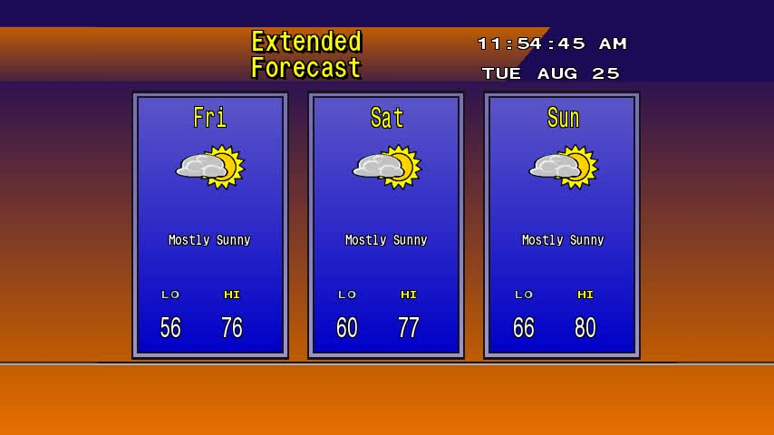
  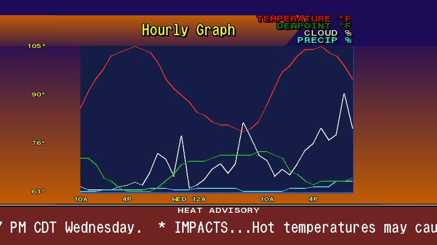
</p>

*(Two of the ~15 screens in the rotation, from example channels — Buffalo,
NY and Austin, TX aren't necessarily where you'll actually point yours.)*

## 2. Prerequisites

- A Docker host (Linux, or Docker Desktop on Windows/Mac)
- Nothing else required for standalone use
- Optional: a running Dispatcharr instance and an API token for it (from
  Dispatcharr's own settings)

## 3. Installation

```sh
git clone https://github.com/jstevenscl/classic4kast-video.git
cd classic4kast-video
docker compose up -d
```

That's it — one image (`classic4kast`), one container, three supervised
processes inside it, pulled straight from
`ghcr.io/jstevenscl/classic4kast-video` (multi-arch: amd64/arm64).
`AGENT_TOKEN` doesn't need to be set by hand; the container generates and
persists a random one to its data volume on first boot. Only pass
`AGENT_TOKEN=<value>` in the environment if you need to pin it to a
specific value.

To build from source instead of pulling the published image, add a
`docker-compose.override.yml` with `build: .` and run
`docker compose up -d --build`.

## 4. First-run setup

Open `http://<host>:8283`. Since no admin account exists yet, you'll be
dropped straight into the app rather than a login screen — go to
**Settings** and set an admin username/password. Every future visit will
require login.

## 5. Creating your first channel

Go to **Channels → New Channel**:

- **Slug** — a short URL-safe identifier (e.g. `austin-tx`). This becomes
  part of the HLS URL and can't be changed later.
- **City** — display name shown on-screen.
- **Location** — type a city/address and use the geocode lookup, or enter
  latitude/longitude directly.
- **Country/data source** — US (NWS), Canada (Environment Canada), or
  International (Open-Meteo, no API key needed).
- **Units**, **screens to include**, and **render mode** (on-demand renders
  only while someone's watching; always-on keeps rendering continuously —
  costs more CPU but has no cold-start delay).

Save, then use the preview button to confirm it looks right before doing
anything else.

<p align="center">
  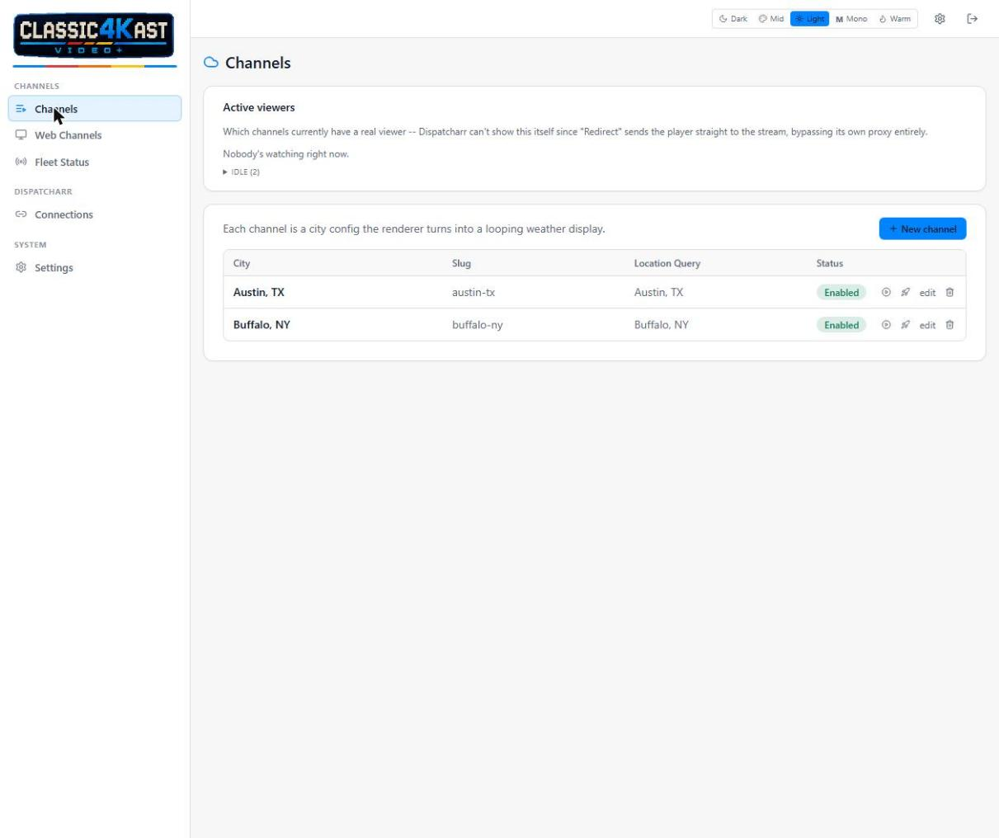
</p>
<p align="center">
  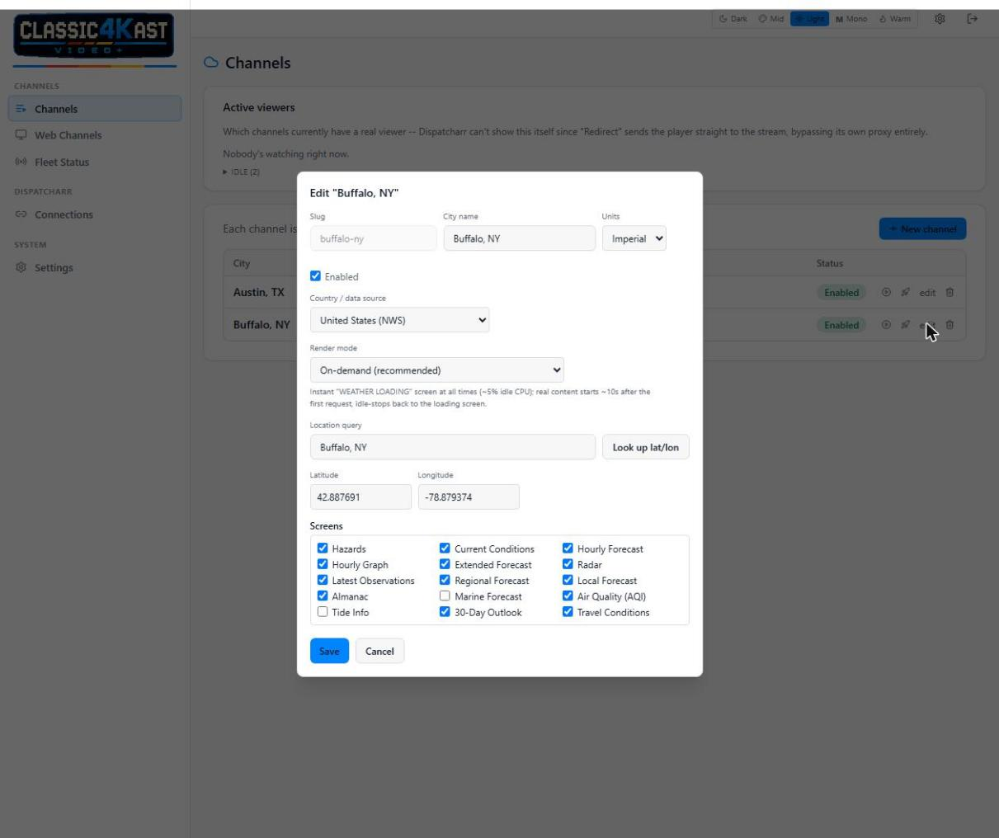
</p>

*(Buffalo, NY and Austin, TX above are just generic example cities used
throughout this guide — pick whatever city you actually want.)*

A US channel sitting near the Canadian border gets real Canadian cities on
its **Regional Observations** map too (current conditions and tomorrow's
forecast, not just city labels) — pulled from Environment Canada
alongside NWS:

<p align="center">
  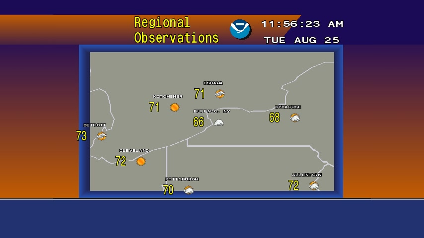
</p>

## 6. Connecting Dispatcharr

Go to **Dispatcharr → Connections → Add Connection**. You need:

- A **label** (just for your own reference — you can add more than one)
- The Dispatcharr instance's **URL**
- An **API token** from that Dispatcharr instance

<p align="center">
  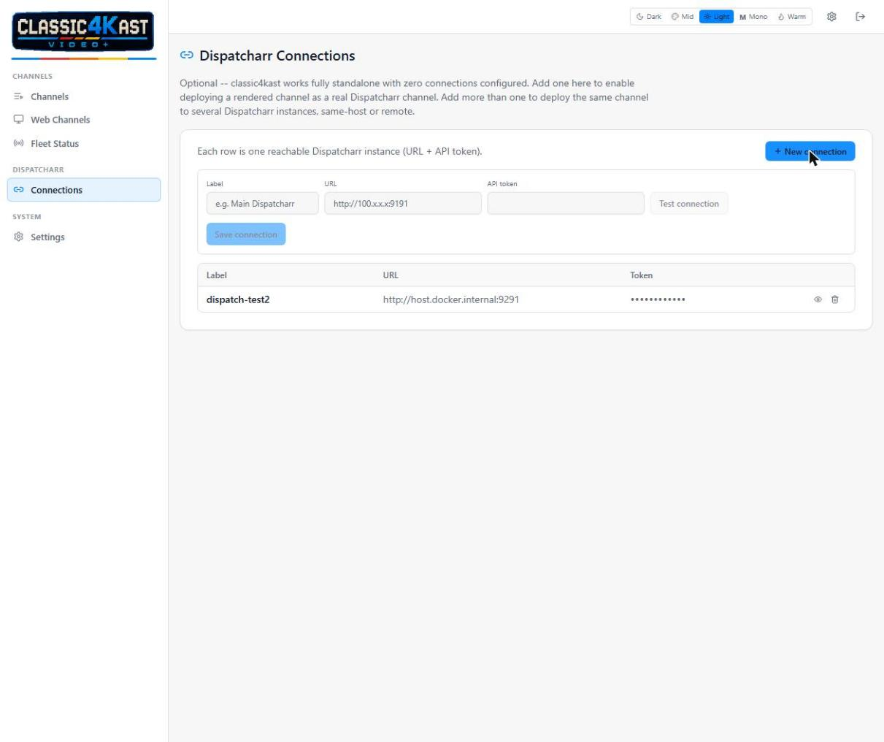
</p>

Use **Test connection** before saving — it confirms Classic4Kast Video+ can actually
reach and authenticate against that Dispatcharr instance. You can add
connections for as many Dispatcharr instances as you have, on this host or
elsewhere.

## 7. Deploying a channel

From the Channels list, click the deploy icon on a channel:

- **Single instance**: pick a connection, a channel group (only groups that
  already contain real channels are shown — Dispatcharr's stream-import-only
  groups are filtered out automatically), a channel name, and a stream
  profile. Leave the stream profile on its default (**Redirect**) unless you
  have a specific reason not to — see [section 9](#9-fleet-status--troubleshooting-stutter).
- **Multiple instances**: check every connection you want to deploy to at
  once; group and profile are matched by name across all of them.

Deployed channels show up in the channel's deploy list with per-deployment
refresh/remove actions, and in **Fleet Status** for render health.

## 8. Overriding the default port

Everything (weather renderer, web-channel renderer, admin UI/API) runs as
three supervised processes inside the one `classic4kast` container,
talking to each other over `localhost` — there's no split-host scenario to
configure. The only thing you'd realistically override is the published
port: copy `docker-compose.override.yml.example` to
`docker-compose.override.yml` and uncomment the port mapping shown inside
it.

Dispatcharr itself never needs a compose change regardless of where it
runs — every connection is just a URL + token entered from the
**Dispatcharr → Connections** page.

## 9. Fleet status & troubleshooting stutter

**Fleet Status** shows each channel's last render time and result, with a
manual re-render button if something looks stale.

<p align="center">
  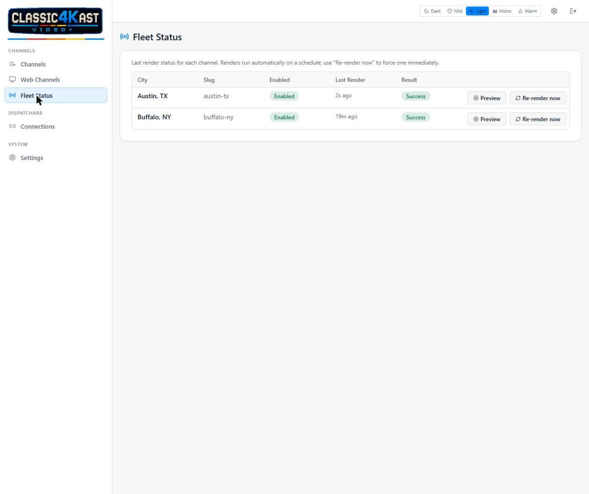
</p>

If viewers report stuttering or a clock that's slowly drifting out of sync,
check the deployed channel's **stream profile** in Dispatcharr — it should
be **Redirect**, not **Proxy**. Proxy has been observed adding multi-hour
clock drift (10–12 min/hour) against Classic4Kast Video+'s own steady stream; Redirect
sends players straight to the renderer and avoids that entirely. This is
usually the fix, not a Classic4Kast Video+ bug.

## 10. Security

- Set an admin password on first run — don't leave the instance open on a
  network you don't control.
- Dispatcharr API tokens are encrypted at rest.
- If you're exposing Classic4Kast Video+'s stream output beyond your own network, set
  a **stream key** (Settings → Stream Key) — it's baked into the deployed
  HLS URL and required to fetch segments once set.

<p align="center">
  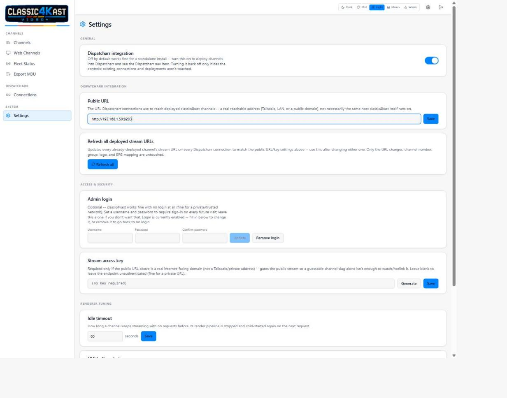
</p>

## 11. Web Channels (websites & Grafana dashboards)

Separate from weather channels: **Web Channels** turns an arbitrary web
page — a Grafana dashboard, a status board, an internal tool — into its
own looping HLS stream, deployable to Dispatcharr the same way. It's a
different rendering path (a shared headless-Chromium instance takes
periodic screenshots, or for Grafana a direct API call with no browser at
all) and runs as its own process, so it never affects weather channel
performance.

<p align="center">
  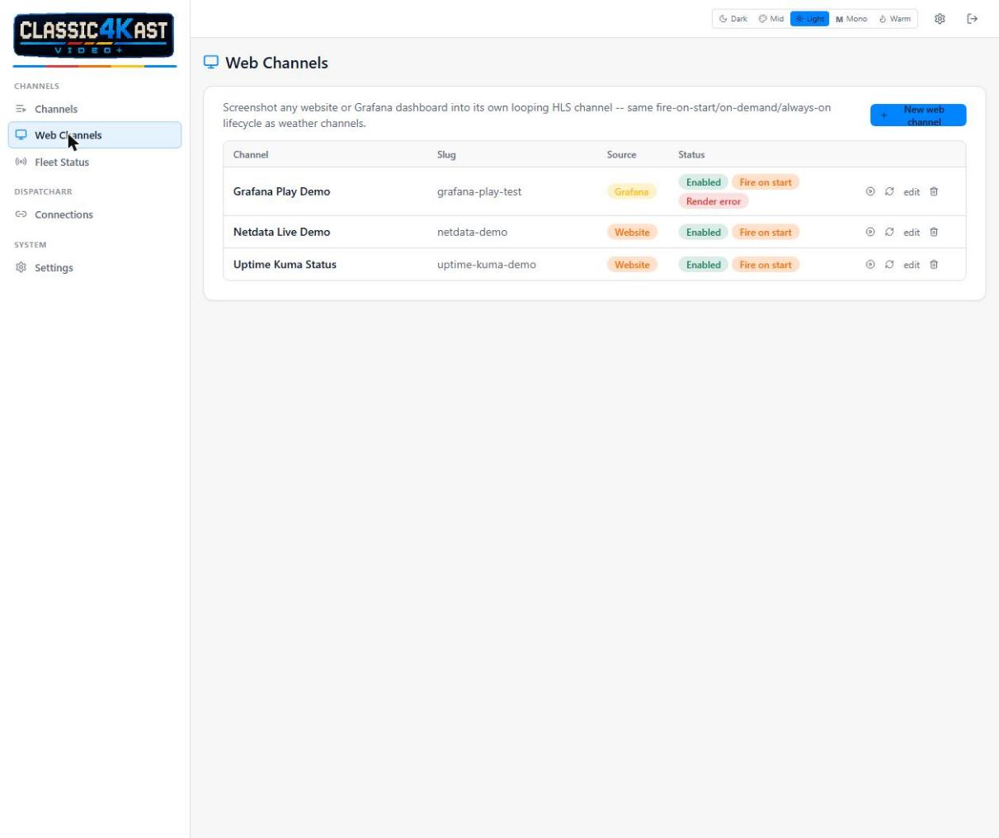
</p>

Go to **Web Channels → New web channel**:

- **Slug** / **Channel name** / **Enabled** / **Render mode** — same
  meaning as weather channels (see [section 5](#5-creating-your-first-channel)).
- **Source** — choose **Website (screenshot)** or **Grafana dashboard**.

<p align="center">
  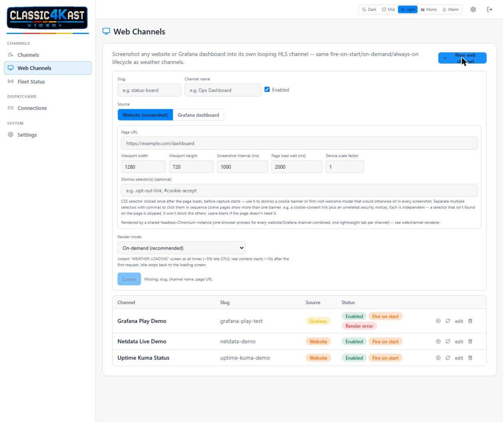
</p>

**Website (screenshot) fields:**

- **Page URL** — the page to capture.
- **Viewport width/height** — the browser window size used for the
  screenshot (also sets the stream's resolution).
- **Screenshot interval (ms)** — how often a new screenshot is taken.
  Lower is more "live" but costs more CPU; most dashboards don't need
  anything faster than a few seconds.
- **Page load wait (ms)** — how long to wait after navigation before
  capture starts, so charts/animations have time to finish loading.
- **Device scale factor** — bump above 1 for a sharper capture on a
  dense dashboard (at the cost of a larger screenshot).
- **Dismiss selector(s)** — see below.

**Grafana dashboard fields:** base URL, dashboard UID, panel ID, API
token, org ID, and a time range — this path calls Grafana's own
`grafana-image-renderer` HTTP endpoint directly, no browser involved.
Use **Test connection** before saving to confirm the URL/token/UID are
right and `grafana-image-renderer` is actually installed on that Grafana
instance.

### Dismissing cookie banners & welcome modals

Some pages show a banner or first-visit modal that would otherwise sit in
every single screenshot forever (a cookie-consent prompt, a "welcome"
overlay, etc). The **Dismiss selector(s)** field clicks it away once,
right after the page loads and before capture starts — it never re-fires
on later screenshots.

To find the selector:

1. Open the target page in a normal browser tab.
2. Right-click directly on the banner's dismiss control (its "No thanks" /
   "Accept" / "Got it" button, or an X icon) and choose **Inspect**.
3. In the dev tools panel, right-click the highlighted element →
   **Copy → Copy selector** (or just read off a `class`/`id` from the
   element, e.g. `.opt-out-link` or `#cookie-accept`).
4. Paste it into the **Dismiss selector(s)** field and save.

**A page with more than one banner** (e.g. a cookie-consent link *and* an
unrelated security notice bar) needs more than one click. Separate
selectors with a comma to click each in sequence:

```
.opt-out-link, .security-banner .close-btn
```

Each selector is independent — if one isn't found on a given page load
(the banner didn't show that time, or doesn't exist at all), it's skipped
and logged, and the rest still run. Leave the field blank entirely if the
page has nothing to dismiss.

### Logging into gated pages (session capture)

Some pages you'd want to put on a channel — a self-hosted dashboard, a
NAS/NVR web UI, anything behind cloud SSO or MFA — can't be captured at
all until you're logged in. **Log in** solves this without ever storing a
password: instead of a scripted username/password fill (which cloud SSO +
MFA would defeat anyway), you drive the *real* page yourself through a
live remote view, and once you're on the logged-in screen, the resulting
session is captured and reused automatically on every future screenshot.

On a **Website** channel's row, click **Log in**. A live view of the
actual page opens — click and type into it exactly like a normal browser
tab, including any MFA prompt:

<p align="center">
  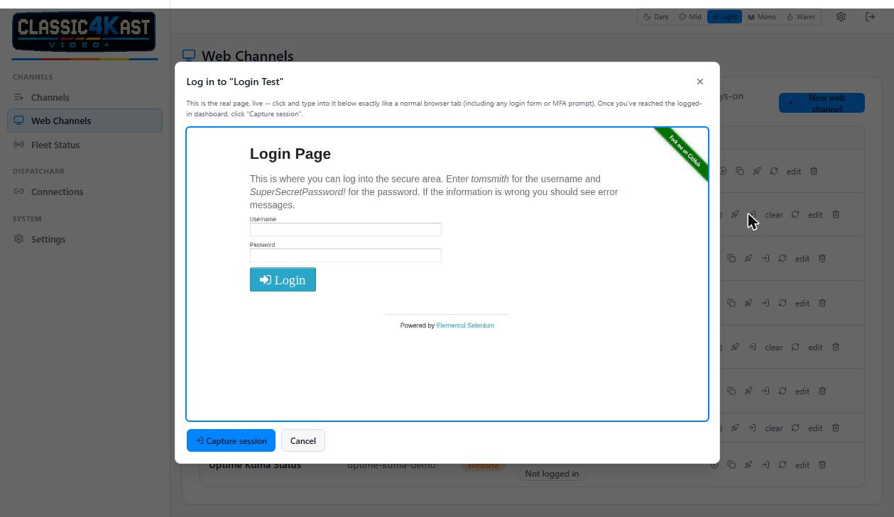
</p>

Once you've reached the logged-in page, click **Capture session**. The
channel's row now shows a **Session captured** badge, and every future
screenshot cycle reuses that session automatically — no re-login needed
until the site's own session expires:

<p align="center">
  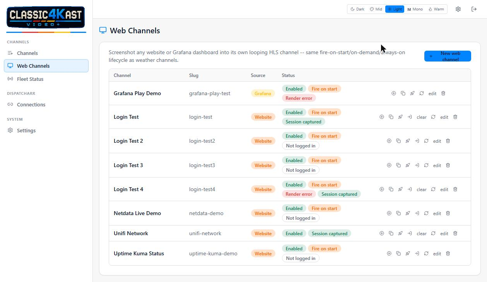
</p>

A couple of things worth knowing:

- **Point `target_url` at the actual page you want captured**, not a
  login/landing page — some sites render their login form regardless of
  session state if you navigate straight to it, so pick the destination
  URL you land on *after* logging in (e.g. `/dashboard`, not `/login`).
- **No generic "session expired" detection.** If a captured session goes
  stale, the channel's screenshot loop just starts showing the site's own
  login page again — visible in the stream, not a silent failure — and
  you'll need to click **Log in** again. There's no reliable way to detect
  this generically across arbitrary sites.
- **Clear** removes a captured session (shown once one exists), forcing a
  fresh login next time.
